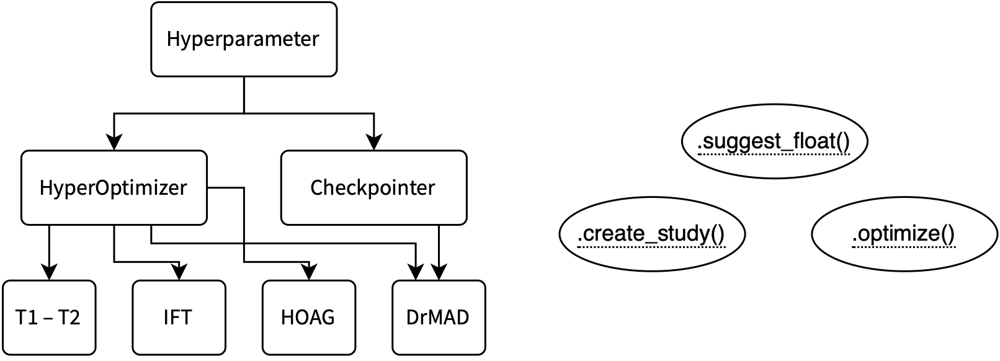

# Project planning

In this file, we provide information about the planning of our work on the library named **HippoTrainer** (`hippotrainer`). 

Since its implementation is carried out as a part of [BMM](https://github.com/intsystems/BMM) course, we consider it a full-fledged project named **Gradient-Based Hyperparameter Optimization** and therefore make detailed, long-term planning. 

This document is structured as follows:

1. [Motivation](#motivation)
2. [Algorithms to implement](#algorithms)
3. [Architecture of the project](#architecture)
4. [Schedule](#schedule)

## Motivation 

Hyperparameter optimization remains one of the most time-consuming aspects of machine learning workflows. 
Traditional methods like grid/random search or Bayesian optimization struggle with high-dimensional spaces and require extensive computational resources. 
Our solution enables efficient gradient-based optimization of hyperparameters through automatic differentiation.

## Algorithms to implement (from simplest to hardest) 

In this project, we are going to implement the following algorithms:
1. **T1-T2** ([Paper](http://proceedings.mlr.press/v48/luketina16.pdf)): One-step unrolled optimization
2. **Neumann** ([Paper](http://proceedings.mlr.press/v108/lorraine20a/lorraine20a.pdf)): Leveraging Neumann series approximation for implicit differentiation
3. **HOAG** ([Paper](http://proceedings.mlr.press/v48/pedregosa16.pdf)): Implicit differentiation via conjugate gradient
4. **DrMAD** ([Paper](https://arxiv.org/abs/1601.00917)): Memory-efficient piecewise-linear backpropagation

## Architecture of the project 

1. **Core Components**:
   - `HyperOptimizer`: Base class for all algorithms + `suggest_float()`, `create_study()`, `optimize()`
   - `Hyperparameter`: Differentiable wrapper for hyperparameters
   - `Checkpointer`: Memory management via parameters checkpointing

2. **PyTorch Integration**:
   - Inherit from `torch.nn.Module` for model compatibility
   - Use `torch.autograd` for gradient computation
   - Support standard PyTorch optimizers and data loaders

> [!NOTE]
> Below we present a diagram of the implementation of our project, demonstrating the class inheritance, as well as the methods necessary for implementation.

## Schedule 

In order to getting all things done, we prepared a comprehensive schedule. 
We highlight the main events and deadlines that we are going meet to. 
All the contributions are assigned with their own tasks. 
Thus we suppose the project to be done in the distributed manner, exhibiting the best possible advantages from all the participants.

> [!NOTE]
> This version is preliminary, as the keypoints, i.e. techical meetings, have preliminary dates too.
> Moreover, up to date only main actions are noted.
> We will expand this schedule, providing a more detailed description of each task.

| Week # | By date | Deadline | Assignee | Task |
| :----: | :-----: | :------: | :------: | :--: |
| 1    | Feb 18   | Team Assignment    | All       | Team is formed, project idea is discussed |
| 2    | Feb 25 | **TM1** Kickoff    | All       | Repository setup, analyze papers, prepare info for slides | |
| 3    | Mar 4    | Core Infrastructure | Igor      | Implement base `HyperOptimizer` class, publish preliminary docs for it |
|      |             |                    | Nikita    | Implement `Hyperparameter` class, think about a blogpost idea |
| 4    | Mar 11   | Algorithm Prototyping | Daniil   | HOAG conjugate-gradient implementation, setup proof of concept |
|      |             |                    | Andrey    | DrMAD checkpointing system, make simple test |
| 5    | Mar 18   | **TM2** Mid-review | All       | Validate core functionality, drafty version of documentation, basic tests |
| 6    | Mar 25   | API Finalization   | Igor      | Standardize optimizer interfaces |
|      |             |                    | Nikita    | Implement Neumann (million hyperparams) support, start blog-post writing |
| 7    | Apr 1     | Testing & Benchmarks| Andrey    | Implement core DrMAD functionality |
|      |             |                    | Daniil    | Tests for HOAG implemented |
| 8    | Apr 8    | **Checkpoint**     | All       | Documentation, examples, packaging, blog-post almost done |
| 9    | Apr 15   | Cross-Review Prep  | All       | Prepare for cross-review |
| 10   | Apr 22   | Cross-Review       | All       | Review other teams' work |
| 11   | Apr 29 | Final Prep | All       | Finalize library, demos, tests |
| 12   | May 6    | **TM3** Final Review | All     | Present final work, blog-post |
| 13   | May 13   | External Review    | All       | Address feedback from external review |
| 14   | May 20      | Grades & Finalizing | All       | Finalize all work, discuss fixes |
